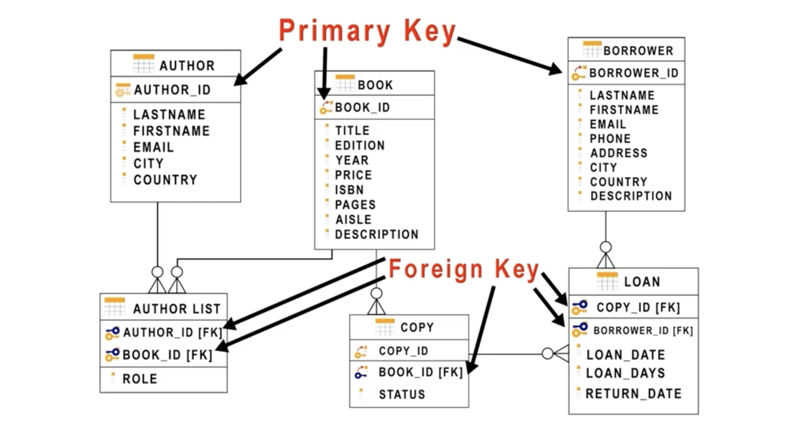

# The Relational Model and Data Independence  

The relational model is the most used data model for databases because this model allows for data independence. Data is stored in a simple data structure.  

### Tables:  
This provides:  
- **Logical Data Independence**  
- **Physical Data Independence**  
- **Physical Storage Independence**  

---

## "Chat GPT"  

I don't understand this part:  
> "This provides logical data independence, physical data independence, and physical storage independence."

What are **data independence, physical data independence, and physical storage independence**?  
How does a table provide them?  

## 1. Data Independence  
Data independence means that changes in one level of a database should not affect other levels. The relational model provides data independence because it separates how data is stored from how it is used.  

## 2. Logical Data Independence  
Logical data independence means that changes in the database schema (such as adding a new column to a table or modifying relationships between tables) **do not affect applications or queries that use the data**.  

For example, if you have a table `Employees(id, name, salary)` and later you add a new column `address`, existing queries that fetch `id, name, salary` will continue to work without modification.  

## 3. Physical Data Independence  
Physical data independence means that changes in how data is physically stored **do not affect the logical structure of the database**.  

For example, if the database moves from one type of storage (e.g., HDD to SSD) or changes indexing methods, the tables and their relationships remain the same for users and applications.  

## 4. Physical Storage Independence  
Physical storage independence goes even deeper, meaning that the way data is **internally stored on disk** (e.g., row-based vs. column-based storage, compression techniques, or distributed storage) **does not affect how the tables are designed or how users interact with them**.  

## How Tables Provide These Forms of Independence  

- **Tables separate logical data representation from physical storage.**  
  A table is a high-level abstraction that represents data in rows and columns without exposing how the data is actually stored on disk.  

- **Queries work at the logical level.**  
  You can write SQL queries without knowing how the database stores the data internally.  

- **Physical optimizations are invisible to users.**  
  The database engine can optimize storage (e.g., using indexes, partitioning, caching) without changing the table design.  

So, the relational model ensures that applications remain **unaffected** by changes in storage, schema, or indexing, making it easier to maintain and scale databases over time.  

---
An entity relationship data model, or ER data model, is an alternative to a relational data model.

Using a simplified library database as an example, this figure shows an entity relationship diagram or ERD that represents entities called tables and their relationships. In the library example, we have books. A book can be written by one or many authors. The library can have one or many copies of a book. Each copy can be borrowed by only one borrower at a time. 

An entity relationship model proposes thinking of a database as a collection of entities rather than being used as a model on its own, the ER model is used as a tool to design relational databases.

---

## "Chat GPT"  
I don't understand the difference between **"Entity Relationship Data Model"** and **"Relational Data Model"**.  

I don't understand this part:  
> "An entity relationship model proposes thinking of a database as a collection of entities rather than being used as a model on its own."  

What does it mean to think of a database as a collection of **entities**?  

I also don't understand this part:  
> "The ER model is used as a tool to design relational databases."  

Is the ER model an **alternative** or a **tool** for relational databases?

## 1. Difference Between ER Model and Relational Model

*   The **Entity-Relationship (ER) model** is **a conceptual design tool** used to **visually** represent the structure of a database before it is built. It helps in understanding the relationships between different entities (e.g., "Customer," "Order," "Product").
*   The **Relational Model**, on the other hand, is **the actual implementation** of a database where data is stored in tables (relations), with rows (tuples) and columns (attributes).

## 2. Meaning of "An entity relationship model proposes thinking of a database as a collection of entities rather than being used as a model on its own"

This means that the **ER model is not a database itself**—it is a way of **conceptually designing** how the database should be structured by thinking of it in terms of entities (real-world objects) and their relationships. However, the ER model **does not store data or have operations like querying—it is just a blueprint**.

## 3. Meaning of "The ER model is used as a tool to design relational databases"

This means that the **ER model helps in designing relational databases**. It is not an alternative to the relational model but rather a **tool** that helps in structuring data before it is stored in relational tables. Once an ER model is created, it is later converted into relational tables (relations) that can be implemented in a relational database system like MySQL, PostgreSQL, or Oracle.

## Final Clarification: Alternative vs. Tool

*   If the text says, "An entity relationship data model is an alternative to a relational data model," that might be misleading.
*   The ER model is **not** really an alternative to the relational model; rather, it is a **design tool that is used before building a relational database**.

---
In the ER model, entities are objects that exist independently of any other entities in the database. The building blocks of an ER diagram are entities and attributes. An entity can be a noun: person, place, or thing. In an ER diagram, an entity is drawn as a rectangle. Entities have attributes which are the data elements that characterize the entity. Attributes tell us more about the entity. In an ER diagram, attributes are drawn as ovals. Attributes are certain properties or characteristics of an entity and tell us more about the entity.

The entity book has attributes such as book title, the edition of the book, the year the book was written, etc Attributes are connected to exactly one entity. The entity book becomes a table in the database and the attributes become the columns in a table. A table is a combination of rows and columns. While mapping, the entity becomes the table. Having said that, the table has not yet taken the form of rows and columns. The attributes get translated into columns in a table providing the actual table form of rows and columns. Later, we add some data values to each of the columns, which completes the table form.

Each attribute stores data values of different formats, characters, numbers dates, currency, and many more besides. In the book table example, the title is made up of characters. As book titles vary in length, we can set the variable character data type for the title column: VAR char. For character columns that do not vary in length, we use character or char. The Edition and year columns would be numeric. The ISBN column would be char because it contains dashes as well as numbers and so on. Using the book entity mapping as an example, we can create the tables for the remainder of our simplified library example using entity names, like author, author list, borrower, loan, and copy.

The entity attributes will be the columns of the tables. Each table is assigned a primary key. The primary key of a relational table uniquely identifies each tuple or row in a table, preventing duplication of data and providing a way of defining relationships between tables. Tables can also contain foreign keys which are primary keys defined in other tables, creating a link between the tables.

---

Now you know that the key advantage of the relational model is logical and physical data independence and storage independence. Entities are independent objects which can have multiple characteristics called attributes. When mapping to a relational database, entities are represented as tables and attributes map to columns. Common data types include characters such as char and VAR char, numbers such as integer and decimal, and timestamps including date and time. A primary key uniquely identifies a specific row in a table and prevents duplication of data.